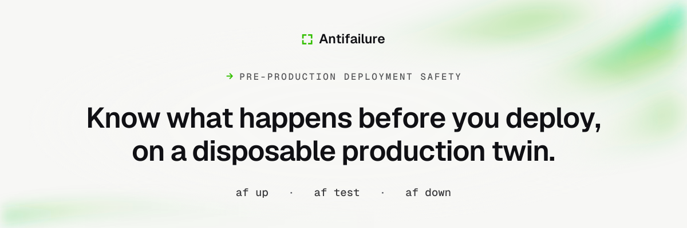

<p align="center">
  
</p>

<p align="center">
  <strong>A disposable copy of your production stack for every pull request.</strong><br>
  Masked Postgres, contained third-party APIs, and agents that use your app like people.
</p>

<p align="center">
  <a href="https://antifailure.dev/docs">Documentation</a> &middot;
  <a href="https://antifailure.dev/docs/getting-started/quickstart">Quickstart</a> &middot;
  <a href="https://antifailure.dev/changelog">Changelog</a> &middot;
  <a href="CONTRIBUTING.md">Contributing</a> &middot;
  <a href="SECURITY.md">Security</a>
</p>

<p align="center">
  <a href="LICENSE"></a>
</p>

---

## Why it exists

The question before a risky deploy is always the same, and the usual ways of
answering it answer a different question.

| What you do before shipping | What it does not tell you |
| --- | --- |
| Run the suite against a seeded database | How long the migration holds a lock at production's row counts. Four seconds on an empty database is ninety on a real one. |
| Click around staging | Whether the path that charges a card would have charged one, because staging reaches the vendor too. |
| Read the migration in review | Whether that `ALTER TABLE` rewrites the table. The statement does not say. It depends on the server version and on the type it is coming from. |
| Ship behind a flag and watch | Nothing, until customers are already on it. |

Antifailure answers them by building the thing you were going to deploy to,
one copy per branch, and then destroying it.

## What it does

**A masked copy of production, and the masking is proved.** The rules compile
to SQL and run in resumable chunks, deterministic, so one customer maps to the
same fake customer across every table and every refresh. A scanner then reads
the result back with the detectors that would find a leak, sampling rows, and
signs an attestation recording the sample size it used. An unverified golden
cannot be branched, and that is enforced in code rather than in a checklist.

**A network the application cannot get around.** Every environment sits on a
network with no route out. The only thing on both networks is a sidecar that
owns the namespace, so a client that ignores its proxy variables has nowhere to
send the packet. Interception is by DNS, which is what makes it work for
runtimes with no proxy support and for SDKs that bundle their own client. Each
host gets one of six modes: `block`, `allow`, `sandbox`, `capture`, `mock` and
`synth`. A live credential on the way out is refused rather than redacted.

**Agents, not scripts.** A workflow is a sentence. The runner drives a real
browser through the accessibility tree, signs in the way a person does with a
password, a magic link out of the captured inbox, a one time code or TOTP, and
answers with `pass`, `fail`, `flaky`, `blocked` or `unverified`, a video, a
trace and steps to reproduce. A failure caused by the runner is classified as
such and never counted against your application.

**Database review the branch makes possible.** Pending migrations are rehearsed
on a throwaway branch of the golden, every statement timed on its own, with
`pg_locks` sampled every 250 milliseconds from a second connection because a
lock held by a statement in flight is invisible to the session holding it.
Whether a statement rewrites a table is answered by an event trigger rather
than by reading the SQL. Query plans and `pg_stat_statements` are diffed
against a baseline saved on the base branch.

## Try it

Docker and a Postgres connection string you are allowed to read from. No
account, no control plane, nothing calls home.

```bash
curl -fsSL https://antifailure.dev/install.sh | sh

af start          # where you are on this machine, and the single next command
af runner install # the agent runner, which drives a real browser and needs node
af init           # reads your repo, writes antifailure.yaml
af up             # masked database branch, built services, sealed network
af test           # agents run your workflows and return verdicts with evidence
af down           # every resource it created, gone
```

`af start` is the one to remember. It reports every step of that list as
observed on this machine right now and names the one command to run next, so a
first run you walked away from is one you can walk back into. It runs nothing
and writes nothing.

The manifest is the whole configuration surface. Nothing about an environment
is configured anywhere else.

```yaml
version: 1
name: next-orders

services:
  - name: web
    kind: web
    path: .
    port: 3000
    health_path: /api/health
    migrate: "psql $DATABASE_URL -v ON_ERROR_STOP=1 -f migrations/0001_init.sql"
    build:
      strategy: dockerfile
      dockerfile: Dockerfile

database:
  provider: docker
  version: 17
  masking_rules: masking.yaml

egress:
  default: block

workflows:
  - name: read-the-spend-by-customer
    description: >-
      As the visitor, open the orders page and check that a customer out of the
      branch is on it, in a table rather than in the empty state.
    persona: visitor
    start_path: /
    expect:
      - "Katherine Johnson"
```

That manifest is `examples/next-app/antifailure.yaml`, and it runs. Beside it
are `examples/go-api` and `examples/django-api`, and
`examples/github-workflow.yml` is the same run inside GitHub Actions, which
leaves one comment on the pull request and edits it in place.

## Your coding agent can run it

`af mcp` serves the rehearsal tools to an agent over the Model Context
Protocol. It is started by an MCP client rather than typed, in the checkout it
should serve, and it speaks the protocol on standard input and output, so
running it in a terminal looks like it has hung. It needs no account, no
control plane and no model key of its own.

The part worth reading twice is what an agent cannot do with it. The agent
chooses the hypothesis and Antifailure chooses the safety controls, and that is
a property of the schemas rather than a convention the tools ask an agent to
respect. There is no argument on any tool that can disable sanitization, widen
the egress policy, lower a threshold, name a database or skip the rehearsal,
and unknown fields are refused rather than ignored. So an agent cannot weaken
an experiment in order to make its own change pass. Thresholds come from the
`policy` block of your manifest, and the verdict comes from the same evaluator
`af ci` uses, so a tool call and a pull request check cannot disagree about the
same change.

| Tool | What it does |
| --- | --- |
| `rehearse_migration_safety` | Applies the branch's pending migrations to a throwaway branch of a masked copy of production and reports the slow statements, the tables Postgres rewrote, the locks and their durations, and what the schema linter objected to at production's table sizes. Returns a `run_id`. |
| `inspect_egress_firewall` | What the environment may reach, what it reached, and whether containment held. Read only. Reports whether a sandbox credential was really swapped on the way out, which is the case that otherwise looks identical to a working one. |
| `get_rehearsal_run` | Status, and the verdict once it has finished. Evidence is paginated. |
| `cancel_rehearsal_run` | Asks a run to stop at the next point it can tear down safely, rather than killing it and leaking the environment. |

A run answers `PASS`, `FAIL` or `INCONCLUSIVE`. `INCONCLUSIVE` is not a weaker
`PASS`: an experiment that did not finish says nothing about the change. The
[MCP reference](https://antifailure.dev/docs/reference/mcp) has the rest.

## What is in here

| Path | What it is |
| --- | --- |
| `engine` | The Go engine and the `af` command. Orchestration, masking, verification, egress policy, insights, the journal, and the MCP server. |
| `runner` | The agent runner. TypeScript, because it drives Chromium, and installed beside `af` rather than downloaded. |
| `schemas` | The JSON Schemas that are the source of truth. The Go types mirror `schemas/manifest.v1.json` and a test fails when they drift. |
| `examples` | Three applications that run: a Next.js app, a Go API, a Django API. |
| `web` | The optional control plane: organizations, policy, aggregated reports, billing. |
| `console` | The signed-in dashboard. |
| `www` | The marketing site, published to antifailure.dev. |
| `docs` | The documentation site, published under antifailure.dev/docs. |
| `deploy` | Container images and the Helm chart for self-hosting the control plane. |
| `infra` | Terraform for the hosted control plane. |
| `tools` | The build gates. Most of the rules this repository holds itself to are programs in here, not conventions. |
| `ee` | The enterprise edition, never compiled into the community binary, images or chart. |

## What is proven

Four words are used about every component in
[docs/plan/STATUS.md](docs/plan/STATUS.md) and they are not interchangeable.
**proven** means the code exists, its tests pass, and the behaviour has been
exercised end to end against the real thing. **written** means it passes its
tests against a fake and has never talked to the real service. **planned**
means specified, not built. **mixed** means the parts are genuinely in
different states, and the row says which are which.

Proven does not mean it runs in CI. A suite that needs a real vendor account
cannot run on a fork's pull request, so the rows below say where each one ran.

| Database provider | Exercised against | Runs in CI |
| --- | --- | --- |
| Docker | A real daemon and a real Postgres, with nothing left behind across repeated runs | Yes |
| Neon | The real Neon API. Found three bugs a fake would have agreed with. | No, by hand |
| Supabase | The real Supabase Management API, zero skips. Took four runs, and all three bugs it found were orderings rather than states. | No, by hand |
| DBLab | A real Database Lab Engine over a ZFS pool. Found a clone that left the API before its dataset was released. | No, by hand |

The interface they all implement declares 24 behaviours in
`engine/conformance/db.go`, and a provider that cannot support one skips it by
name rather than passing quietly. The suite is itself proved able to fail: a
provider that violates exactly one guarantee has to go red in that named
behaviour, and a positive control asserts the same behaviours pass rather than
skip.

`docs/plan/STATUS.md` carries the same treatment for every other component, and
it is updated in the same pull request as the code.

## How it compares

| | Seeded fixtures | Shared staging | A preview environment | Antifailure |
| --- | --- | --- | --- | --- |
| Data | Invented, and shaped like nothing | Production's, often unmasked | Empty, or shared with every other branch | Production's schema and volume, masked, and the masking verified before it can be branched |
| Isolation | Per test run | One environment, everyone in it | Per branch | Per branch, including the database |
| Third party calls | Mocked inside your process, so untested paths still reach out | Reach the vendor | Reach the vendor | Contained at the network, with a mode per host and a live key refused |
| Migration cost | Not measured | Measured against staging's row counts, which are not production's | Not measured | Rehearsed per statement on production's row counts, locks sampled |
| What is left behind | Nothing | Drift | Usually cleaned on merge | Journaled before creation, compensated on teardown, and a leak detector that fails the build |

## Status and license

Version 1.0 is a promise about what keeps working, written down surface by
surface in [what is stable](https://antifailure.dev/docs/reference/stability)
rather than made as a blanket claim: a manifest declaring `version: 1`, the
commands with their flags and exit codes, the JSON each command documents
under `--output json`, the provider interfaces, and the error codes. That page
also names what is deliberately not covered, which is the half worth reading
first.

Builds are reproducible, and that is a gate rather than an aspiration: two
builds in two directories with two caches produce identical archives on all
four platforms, checked in CI on every pull request.

Contributions are welcome. [CONTRIBUTING.md](CONTRIBUTING.md) covers building
locally, running the gates and structuring commits.

MIT, except the `ee` directory of this repository, which is under the
Antifailure Enterprise License. Nothing under `engine` imports it and a release
archive carries no enterprise source, so a release you download is MIT
throughout. The boundary is proved rather than asserted: a CI job deletes `ee`,
builds and tests the engine from what is left, and then inspects the binary it
shipped for enterprise package paths.
